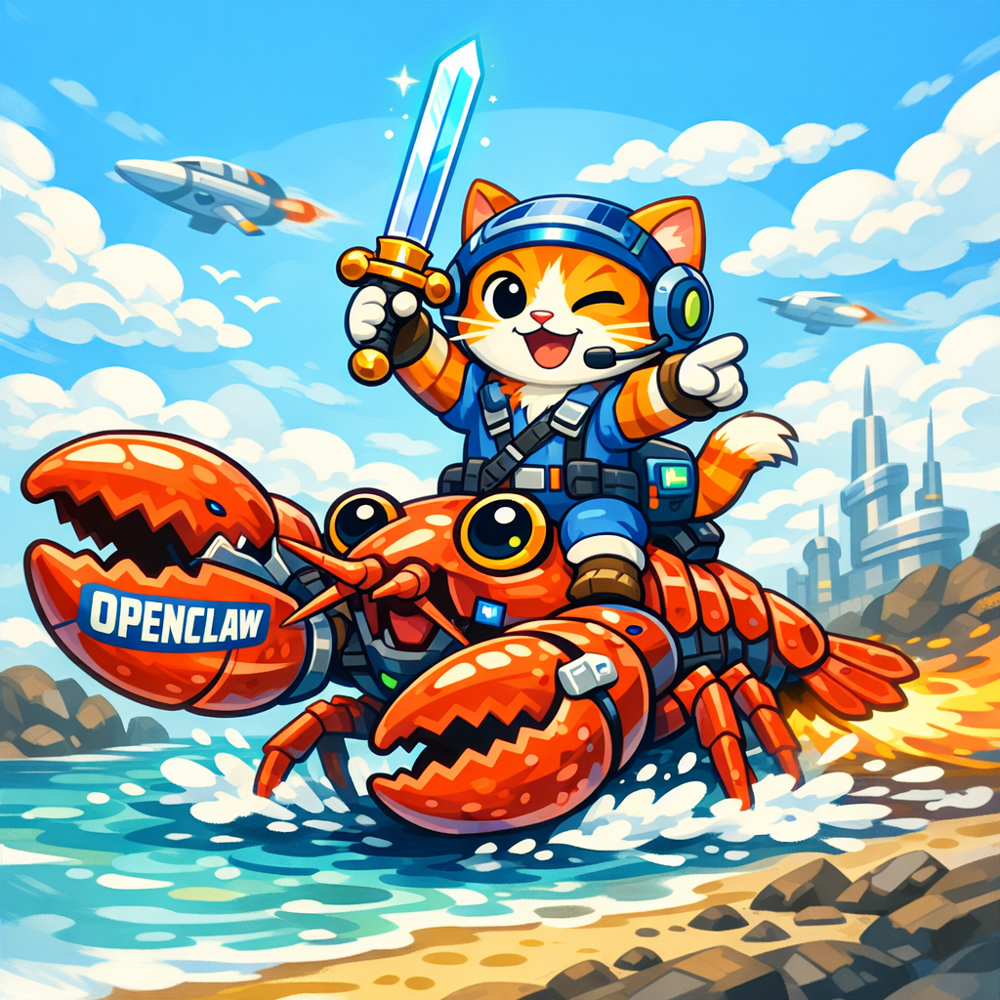

  

+ 

  

# openClaw-coPilot

A Copilot-style developer assistant built on top of OpenClaw. This project provides an integration layer and operator tooling to safely spawn and orchestrate coding agents (Codex, Claude Code, Pi, OpenCode) for code generation, PR review, refactoring, and developer workflows.

Table of contents
- Project overview
- Architecture
- Getting started
- Configuration
- Usage
- Examples
- Development
- Testing
- Security & Safety
- Contributing
- License
- Maintainers & Contact

Project overview

openClaw-coPilot aims to be a safe, auditable, and ergonomically integrated Copilot for teams who already use OpenClaw. It focuses on:

- Providing clear execution patterns for interactive coding agents (PTY vs non-PTY) and background orchestration.
- Enforcing workspace isolation so agents cannot access sensitive ~/.openclaw files or developer secrets.
- Offering reusable templates and CLI helpers for common tasks: one-shot generation, PR review, batch fixes, and codebase refactors.

Architecture

- openClaw-coPilot-daemon: (src/daemon) A small process that listens for developer requests, translates them into coding-agent runs, and monitors progress using OpenClaw process tools.
- CLI helpers: (src/cli) Scripts and wrapper commands that make it easy to launch safe review or generation flows.
- Templates: (templates/) Prompt templates and review-checklists used by agents.
- Webhooks/Integrations: (src/webhooks) Optional GitHub/GitLab webhook handlers to trigger automated reviews.
- Examples: (examples/) Reproducible example workflows showing safe PR review and code generation.

Getting started

Prerequisites
- Node.js (>=18)
- pnpm or npm
- OpenClaw installed and configured on your machine
- Codex/Claude/Pi/OpenCode CLIs or API access configured as needed

Local setup

1. Clone the repo

   git clone <repo-url> openClaw-coPilot
   cd openClaw-coPilot

2. Install dependencies

   pnpm install

3. Create a safe working directory for ephemeral agent work

   mkdir -p /tmp/openClaw-coPilot-work && export OC_COPILOT_WORKDIR=/tmp/openClaw-coPilot-work

4. Copy the example config and edit

   cp config/example.json config/local.json
   # Edit config/local.json with your preferred agent, PTY flags, and CLI keys

5. Start the dev server (example)

   pnpm dev

Configuration

config/example.json contains keys you should set before use. Important fields:

- defaultAgent: "codex" | "claude" | "pi" | "opencode"
- workdir: absolute path where ephemeral clones/worktrees are created (avoid ~/.openclaw)
- agentOptions: { codex: { pty: true }, claude: { permissionMode: "bypassPermissions", print: true }, ... }
- webhook.secret: secret for validating incoming webhook payloads

Usage

CLI helper examples (src/cli)

- One-shot generation (scratch)

  pnpm run gen -- --template templates/express-health.txt --out scratch

- Review a PR (safe)

  pnpm run review -- --repo https://github.com/user/repo.git --pr 42

Under the hood these helpers will:
- clone the target repo into OC_COPILOT_WORKDIR or a tmp dir
- checkout the PR branch or ref
- launch a coding agent with the configured flags (PTY if required)
- monitor progress and stream summarized results to the console or create a PR comment

Examples

- Review PR (#42) locally

  REVIEW_DIR=$(mktemp -d)
  git clone https://github.com/user/repo.git $REVIEW_DIR
  cd $REVIEW_DIR && gh pr checkout 42
  # Launch Codex Review (PTY + background recommended)
  bash pty:true workdir:$REVIEW_DIR background:true command:"codex exec 'Review PR #42. Provide a summary, list of issues, and suggested diffs.'"

- Batch fix example (use worktrees)

  git worktree add -b fix/typo-123 /tmp/typo-123 main
  bash pty:true workdir:/tmp/typo-123 background:true command:"codex --yolo 'Fix typos across repo. Commit and push under branch fix/typo-123'"

Development

- Code layout
  - src/daemon - long-running orchestration service
  - src/cli - CLI helpers and wrappers
  - src/lib - shared utilities (git helpers, openclaw wrappers, templating)
  - templates - prompt templates
  - examples - ready-made reproducible flows

- Run linter and tests

  pnpm lint
  pnpm test

- Running locally

  OC_COPILOT_WORKDIR=/tmp/openClaw-coPilot-work pnpm dev

Testing

- Unit tests: pnpm test
- Integration tests: examples/ contains scripts that run end-to-end using temp repos and mocked agent CLIs. These require network access and the CLIs to be installed.

Security & Safety

- Always use isolated transient directories (OC_COPILOT_WORKDIR) for agent execution.
- Never point default workdir to ~/.openclaw or other personal config locations.
- Agent flags: codex/pi/opencode should run with PTY enabled when using their CLIs. Claude should run with permission-mode bypassPermissions + --print when non-PTY.
- Audit logs: all agent runs are recorded to logs/ with timestamps, prompts, and short summaries. Rotate logs regularly.
- Secrets: store API keys in your environment or a secrets manager — do not commit keys to config/local.json.

Contributing

We welcome contributions. Quick guide:

1. Fork the repo and create a feature branch
2. Run tests and linters
3. Open a PR with clear description and rationale

See docs/CONTRIBUTING.md for full guidelines (issue templates, code style, security reporting).

License

This project is licensed under the MIT License. See LICENSE for details.

Maintainers & Contact

- Maintainer: your-name@example.com
- Issues: <repo-url>/issues

Appendix: Recommended prompts and templates

- templates/review-summary.txt — high-level PR summary prompt
- templates/bug-fix-checklist.txt — checklist for automated fixes
